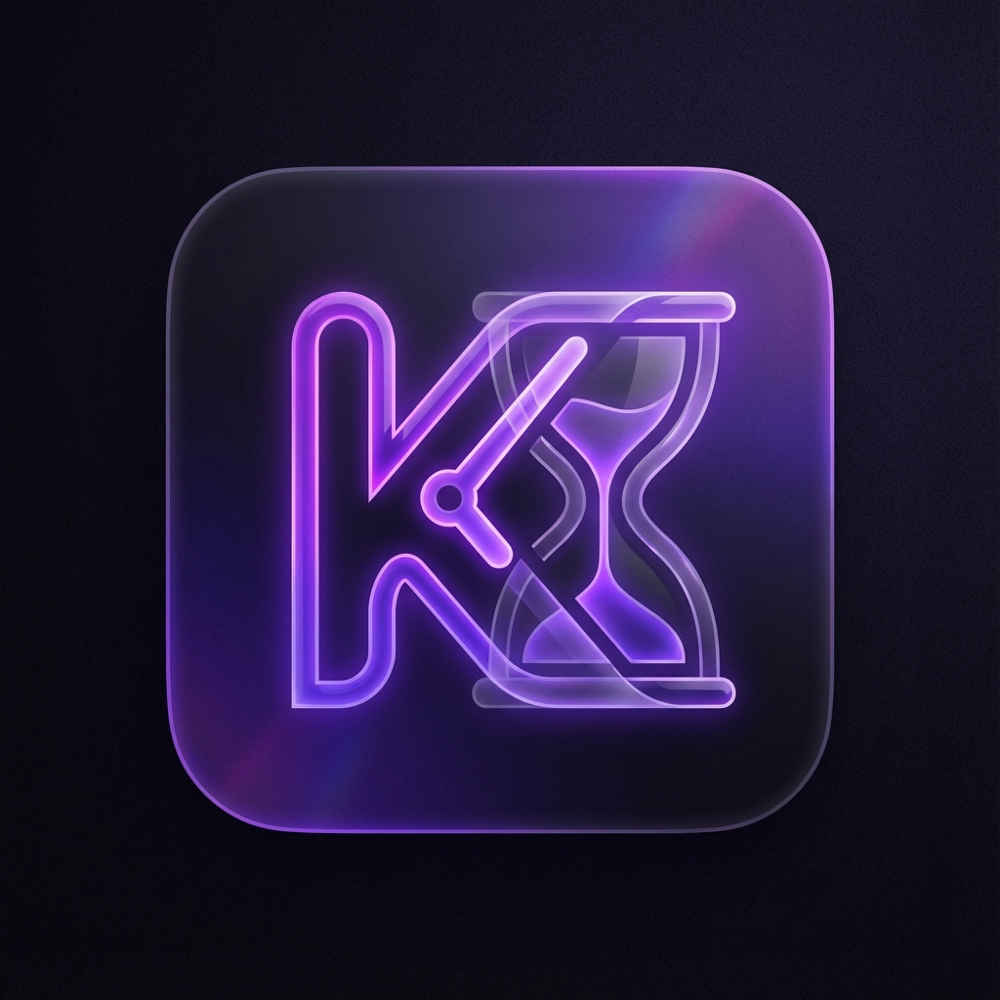

# Kron0

**Kron0** is a modern, neo-glassmorphism inspired productivity companion designed for students. It combines a powerful focus timer, a smart weekly schedule managed via Drag & Drop or simple clicks, and detailed productivity insights—all in a beautifully animated interface.



## Features

- **Focus Timer**: Configurable Pomodoro timer with Focus, Short Break, Long Break, and Custom modes.
- **Smart Schedule**: Visualize your week with a horizontal day view and manage classes effortlessly.
- **Productivity Stats**: Track your focus time vs. class time to stay balanced.
- **Task Management**: Built-in To-Do list to keep track of assignments and goals.
- **Dark/Neon Theme**: A sleek, dark interface with glassmorphism effects and fluid animations.
- **Firebase Sync**: Your data is synced across devices using Google Authentication.
- **PWA Ready**: Installable as a Progressive Web App.

## Repository

The official repository is hosted at:
[https://github.com/Sayanthegamer/kron0](https://github.com/Sayanthegamer/kron0)

## Getting Started

1.  Clone the repository:
    ```bash
    git clone https://github.com/Sayanthegamer/kron0.git
    ```
2.  Install dependencies:
    ```bash
    npm install
    ```
3.  Set up Firebase Environment Variables in a `.env` file (see `src/config/firebase.ts` for needed keys).
4.  Run the development server:
    ```bash
    npm run dev
    ```

## Creator

Designed & Built by **Sayan**.
